# 🛡️ Projeto ProtectMax

O **ProtectMax** é uma plataforma web voltada para segurança digital, oferecendo planos de proteção online, com login de usuário, gerenciamento de conta e apresentação clara das funcionalidades.
O objetivo é fornecer uma solução acessível e confiável para usuários que desejam maior tranquilidade e privacidade ao navegar na internet.

As principais funcionalidades incluem:

- Página inicial com informações de planos de proteção.
- Modal de login e criação de conta.
- Formulário de contato para suporte ao cliente.
- Layout responsivo e adaptado para diferentes dispositivos.

---

## 🚀 Tecnologias Utilizadas
- **Frontend:** HTML, CSS, JavaScript  
- **Backend:** Node.js + Express  
- **Banco de Dados:** MySQL  
- **Hospedagem:**  
  - Frontend: GitHub Pages  
  - Backend & Banco: Railway  

---

## 📊 Arquitetura
O sistema segue a arquitetura **cliente-servidor**.  

```mermaid
flowchart TD
    subgraph Client["Usuário / Navegador"]
        Browser["🌐 Navegador (HTML, CSS, JS)"]
    end

    subgraph Frontend["Frontend (GitHub Pages)"]
        Pages["GitHub Pages (HTML + CSS + JS)"]
    end

    subgraph Backend["Backend (Railway - Node.js + Express)"]
        API["API REST (app.js)"]
    end

    subgraph Database["Banco de Dados (MySQL - Railway)"]
        DB[("MySQL Database")]
    end

    %% Conexões
    Browser -->|"HTTP/HTTPS Request"| Pages
    Pages -->|"Fetch API / HTTP"| API
    API -->|"SQL Queries"| DB
    DB -->|"Resultados SQL"| API
    API -->|"JSON Response"| Pages
```



---

## 📂 Estrutura do Projeto
```
/frontend      → Código do site (HTML, CSS, JS)
/backend       → API em Node.js + Express
  ├── js/
  │   ├── app.js       → Ponto de entrada
  │   ├── db.js           → Conexão com o banco
  │   ├── controller.js  → Lógica da aplicação
  ├── sql/                → Scripts SQL para criação de tabelas
```

---

## 🔄 Fluxo de Requisição

```mermaid
sequenceDiagram
    participant U as Usuário
    participant F as Frontend (GitHub Pages)
    participant B as Backend (Railway - Node.js)
    participant D as Banco de Dados (MySQL)

    U->>F: Acessa site pelo navegador
    F->>B: Requisição HTTP (POST /usuarios)
    B->>D: Consulta SQL (SELECT * FROM usuarios)
    D-->>B: Retorna resultados
    B-->>F: Resposta JSON com as usuarios
    F-->>U: Renderiza as usuarios na tela
```


---

## 💻 Como Executar Localmente

### 1. Clonar o repositório
```bash
git clone https://github.com/thz-tunes/protect-max.git
cd protect-max/frontend/protectmax.html
```

### 2. Configurar Backend
```bash
cd backend
npm install
```

### 3. Criar arquivo `.env`
```env
DB_HOST=localhost
DB_PORT=3306
DB_USER=root
DB_PASSWORD=""
DB_NAME=protectmax
PORT=5000
```

### 4. Rodar o servidor
```bash
npm start
# ou
node --require dotenv/config js/app.js
```

A API estará disponível em:  
👉 http://localhost:5000  

---

## 🌍 Deploy em Produção

No **Railway**, configurar as variáveis de ambiente:  
- DB_HOST  
- DB_PORT  
- DB_USER  
- DB_PASSWORD  
- DB_NAME  
- PORT  

Após isso, o backend ficará disponível online e o frontend no GitHub Pages poderá consumir a API.  

---

## 🔧 Extensões VSCode Recomendadas
- **Material Icon Theme** → Ícones de arquivos e pastas.  
- **Live Server** → Executa projeto localmente.  
- **Live Preview** → Pré-visualização de HTML.  
- **Code Runner** → Executa scripts JS no terminal.
- **Thunder** → Testes GET e POST como no postman

---

## 📑 Atalhos HTML Semântico
- `.nome` → Cria uma div com classe "nome".  
- `section.nome` → Cria uma section com classe "nome".  
- `section#nome` → Cria uma section com id "nome".  
- `section.nome1#nome2` → Cria uma section com classe "nome1" e id "nome2".  

---

## ⌨️ Atalhos VSCode
- `Alt + Shift + i` → Edição em várias linhas.  
- `Ctrl + F2` → Seleciona todas as ocorrências de um termo.  
- `Ctrl + ;` → Comenta/descomenta linhas.  
- `Alt + Z` → Quebra automática de linha.  

---

## 📚 Referências
- [MDN Web Docs](https://developer.mozilla.org/pt-BR/)  
- [W3Schools](https://www.w3schools.com/)  

---

## ⚙️ Git Config Utils
```bash
git config --global user.email "you@example.com"
git config --global user.name "Your Name"
```